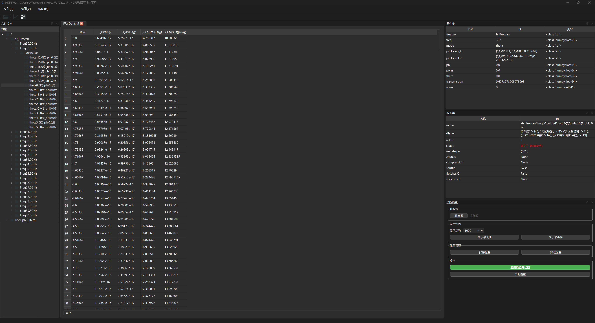
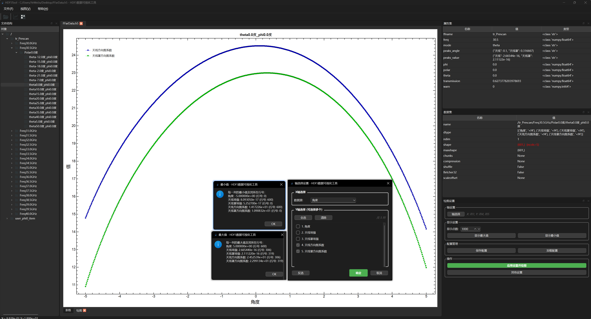
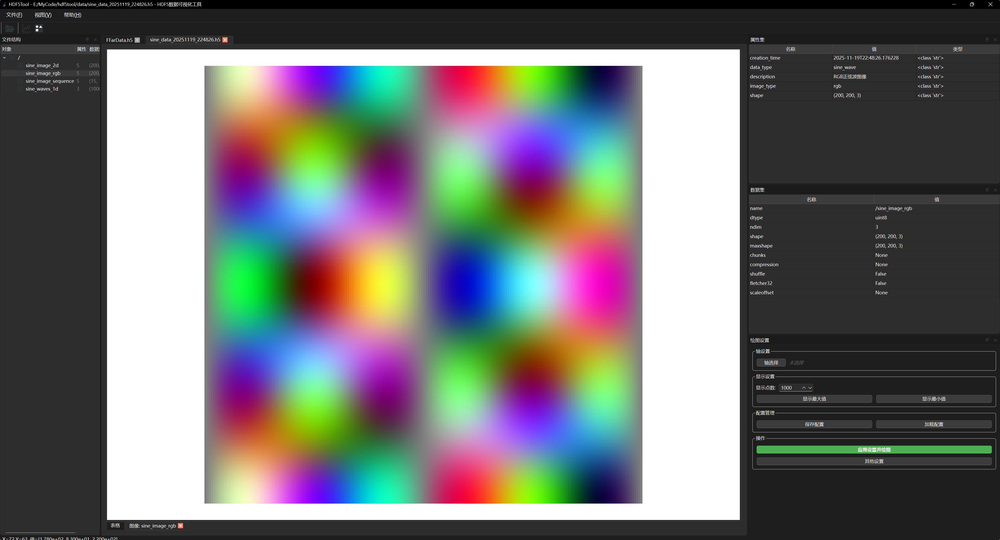

# 🎯 HDF5Tool - HDF5数据可视化工具

<div align="center">


*基于[hdf5view](https://github.com/tgwoodcock/hdf5view)重构的现代化HDF5可视化工具*

</div>

## ✨ 项目特色

本项目在原有hdf5view基础上进行了全面升级：

- 🔄 **现代化GUI框架** - 使用PySide6替代PyQt，提供更现代的界面体验
- 🇨🇳 **完整汉化** - 界面完全中文本地化，操作更友好
- 📊 **专注2D可视化** - 移除"Slice"功能，专注于2D数据绘图和图像显示
- 🖼️ **增强图像功能** - 改进图像显示模块，支持2D/3D图像数据集
- 📤 **数据导出** - 新增CSV导出功能，便于数据分析和处理

一个基于PySide6的HDF5文件可视化工具，提供直观的界面来查看、分析和导出HDF5数据。

## 🚀 核心功能

| 功能模块 | 描述 | 图标 |
|---------|------|------|
| 📁 **文件结构浏览** | 树形视图展示HDF5文件层次结构，支持快速导航 | `tree_view` |
| 📊 **数据表格查看** | 表格形式显示数据集内容，支持排序和筛选 | `table_view` |
| 📈 **交互式数据绘图** | 支持折线图、散点图等多种图表类型，可自定义配置 | `plot_view` |
| 🖼️ **图像显示** | 支持2D/3D图像数据集的可视化，支持缩放和旋转 | `image_view` |
| 📤 **数据导出** | 将HDF5数据导出为CSV格式，便于后续分析 | `export_utils` |
| 🔍 **数据切片** | 支持多维数据的切片查看，便于大数据集分析 | `dataset_view` |
| 🎯 **命令行接口** | 支持通过命令行直接打开文件，提高工作效率 | `cli` |

## 📦 快速开始

### 方法一：从源码安装（推荐）

```bash
# 克隆项目
git clone <项目地址>
cd hd5ftool

# 使用uv安装（推荐）
pip install uv
uv pip install -e . -i https://pypi.mirrors.ustc.edu.cn/simple/

# 或者使用传统pip安装
pip install -e . -i https://pypi.mirrors.ustc.edu.cn/simple/
```

### 方法二：直接运行源码

```bash
# 安装依赖
pip install -r requirements.txt

# 启动应用
python run.py
```

### 方法三：使用包管理器安装

```bash
# 安装到系统环境
pip install hdf5tool

# 或安装到用户环境
pip install --user hdf5tool
```

## 🛠️ 技术栈

### 核心依赖

| 依赖包 | 版本要求 | 用途 |
|--------|----------|------|
| **PySide6** | >=6.4.0 | 现代化GUI框架，提供跨平台界面 |
| **h5py** | >=3.7.0 | HDF5文件读写操作，数据访问接口 |
| **pyqtgraph** | >=0.13.0 | 高性能数据可视化，支持实时绘图 |
| **pandas** | >=1.5.0 | 数据处理和CSV导出 |
| **psutil** | >=5.9.0 | 系统资源监控，性能优化 |

### 安装所有依赖

```bash
# 基础安装
pip install PySide6 h5py pyqtgraph psutil pandas

# 或使用requirements.txt
pip install -r requirements.txt
```

## 🎮 使用方法

### 命令行使用

```bash
# 显示帮助信息
hdf5tool --help

# 打开单个HDF5文件
hdf5tool -f "path/to/your/file.h5"

# 打开多个HDF5文件
hdf5tool -f file1.h5 -f file2.h5 -f file3.h5

# 使用通配符打开所有h5文件
hdf5tool -f "*.h5"

# 跳过文件格式检查
hdf5tool -f "your_file.h5" --no-format-check
```

### 作为Python模块使用

```bash
# 作为模块运行
python -m hdf5tool -f "your_file.h5"

# 直接运行源码
python run.py -f "your_file.h5"
```

### 图形界面操作

1. **打开文件**：通过菜单栏"文件"→"打开"或工具栏打开按钮
2. **浏览结构**：左侧树形视图显示HDF5文件层次
3. **查看数据**：双击数据集在右侧查看表格内容
4. **绘制图表**：选择数据集后点击"绘图"按钮
5. **查看图像**：支持2D/3D图像数据集的显示
6. **导出数据**：选择数据集后导出为CSV格式

## 📁 项目结构

```
hd5ftool/
├── run.py              # 主启动脚本
├── __main__.py         # 包入口点
├── setup.py            # 包安装配置
├── requirements.txt    # 依赖包列表
├── MANIFEST.in         # 包资源清单
├── README.md           # 项目说明文档
├── src/               # 源代码目录
│   ├── main.py        # 应用程序入口
│   ├── mainwindow.py  # 主窗口实现
│   ├── models/        # 数据模型
│   │   ├── __init__.py
│   │   ├── table_models.py
│   │   ├── tree_model.py
│   │   ├── utils.py
│   │   └── view_models.py
│   ├── views/         # 视图组件
│   │   ├── __init__.py
│   │   ├── hdf5_widget.py
│   │   ├── plot_dialog.py
│   │   ├── image_view.py
│   │   ├── plot_view.py
│   │   └── export_utils.py
│   ├── resources.py   # 资源管理
│   ├── resources.qrc  # Qt资源文件
│   └── icons/         # 图标资源
├── config/            # 配置文件
│   ├── deploy_config.py
│   └── plot_config.json
├── scripts/           # 工具脚本
│   ├── build_resources.py
│   └── generate_sine_data.py
├── docs/              # 文档
│   └── HDF5_IMAGE_FORMAT.md
└── data/              # 测试数据
    └── *.h5           # HDF5测试文件
```

## 🔧 开发说明

### 构建Qt资源

```bash
# 编译Qt资源文件
python scripts/build_resources.py --compile
```

### 生成测试数据

```bash
# 生成正弦波测试数据
python scripts/generate_sine_data.py
```

### 项目架构

项目采用模块化设计：

- **models/** - 数据模型层，处理HDF5数据结构
- **views/** - 视图层，实现用户界面组件
- **config/** - 配置文件，部署和应用配置
- **scripts/** - 工具脚本，构建和数据处理

## 📚 相关文档

- [HDF5图像格式说明](docs/HDF5_IMAGE_FORMAT.md) - 如何将图像正确保存为HDF5格式

## 🐛 常见问题

### Q: 命令行工具无法识别？
A: 确保已正确安装包：`pip install -e .`

### Q: 打开文件时提示格式错误？
A: 使用 `--no-format-check` 参数跳过格式检查

### Q: 如何查看帮助信息？
A: 运行 `hdf5tool --help` 或 `python run.py --help`

## 📄 许可证

MIT License

## 🤝 贡献

欢迎提交Issue和Pull Request来改进这个项目。

## 📊 界面预览

### 数据浏览



### 绘图功能



### 图像功能



## 🎯 使用示例

### 基本操作流程

1. **启动应用** → 2. **打开HDF5文件** → 3. **浏览数据结构** → 4. **查看数据内容** → 5. **进行可视化分析**

### 代码示例

```python
# 使用Python API直接操作数据
import h5py

# 打开HDF5文件
with h5py.File('data.h5', 'r') as f:
    # 访问数据集
    dataset = f['/path/to/dataset']
    data = dataset[:]
    print(f"数据集形状: {data.shape}")
```

## 🤝 贡献指南

我们欢迎各种形式的贡献！

### 如何贡献

1. **报告问题** - 在GitHub Issues中提交bug报告或功能请求
2. **提交代码** - Fork项目并提交Pull Request
3. **改进文档** - 帮助完善文档和示例
4. **分享用例** - 分享您使用HDF5Tool的经验

### 开发环境设置

```bash
# 克隆项目
git clone <项目地址>
cd hdf5tool

# 创建虚拟环境
python -m venv venv
source venv/bin/activate  # Linux/Mac
# 或 venv\Scripts\activate  # Windows

# 安装开发依赖
pip install -e .[dev]

# 运行测试
python -m pytest tests/
```

## 📞 支持与反馈

- 📧 **问题反馈**: [GitHub Issues](<项目地址>/issues)
- 💬 **讨论区**: [GitHub Discussions](<项目地址>/discussions)
- 📚 **文档**: [项目Wiki](<项目地址>/wiki)

## 🔄 更新日志

### v1.0.0 (2025-11)
- ✅ 基于hdf5view重构，使用PySide6框架
- ✅ 完整中文本地化界面
- ✅ 增强2D绘图和图像显示功能
- ✅ 新增CSV数据导出功能
- ✅ 优化用户体验和性能

---

<div align="center">

**版本**: 1.0.0  
**最后更新**: 2025年11月  
**开发者**: [风花雪邂逅情歌]  
**致谢**: [tgwoodcock/hdf5view](https://github.com/tgwoodcock/hdf5view)

</div>